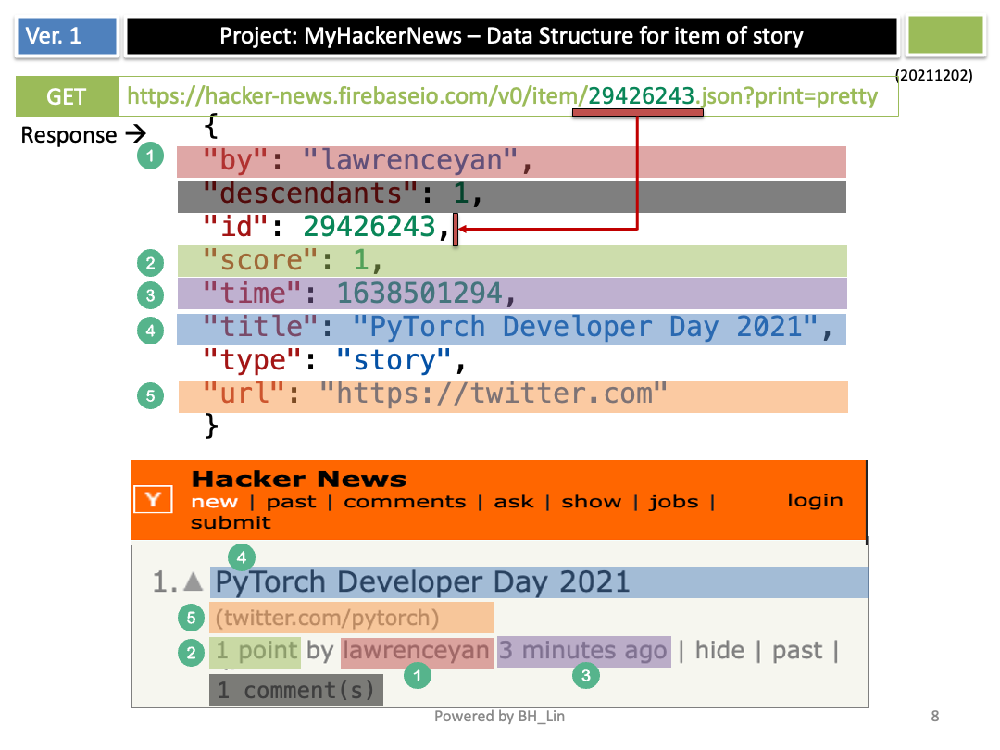

#   
My Hacker News - Android Version
================================================

This is a simple Hacker News Android application for listing new stories.  
The app is built with Jetpack Compose.  
Data source for the project is from [Hacker News API](https://github.com/HackerNews/API).

## Table of Contents
<!-- START doctoc generated TOC please keep comment here to allow auto update -->
<!-- DON'T EDIT THIS SECTION, INSTEAD RE-RUN doctoc TO UPDATE -->
- 
- [My Hacker News - Android Version](#my-hacker-news---android-version)
  - [Table of Contents](#table-of-contents)
  - [Features](#features)
  - [API to Get New Stories](#api-to-get-new-stories)
  - [API to Fetch Item](#api-to-fetch-item)
  - [Illustration](#illustration)
  - [How to Build the App](#how-to-build-the-app)
  - [Related Projects](#related-projects)
  - [Comparison Between iOS SwiftUI and Android Compose](#comparison-between-ios-swiftui-and-android-compose)
<!-- END doctoc generated TOC please keep comment here to allow auto update -->

## Features
- Users can read news from the Hacker News application.
- Users can view the highest-ranked articles.
- Users can open the link associated with each article in the browser.

## API to Get New Stories

## API to Fetch Item

## Illustration

## How to Build the App
- Open `MyHackerNewsAndroid` project in Android Studio.
- Connect an Android device or start an emulator.
- Click the **Run** button to build and launch the app.

## Related Projects
- MyHackerNews for iOS - https://github.com/binghuan/MyHackerNews

## Comparison Between iOS SwiftUI and Android Compose
In SwiftUI, you can navigate seamlessly between code and preview: clicking a component in the preview layout takes you directly to the source code, and clicking on a code block highlights the component in the preview. This two-way navigation enhances the development experience.

In Android Compose, however, navigation is one-way—you can only highlight the code block by clicking on the component in the preview.
